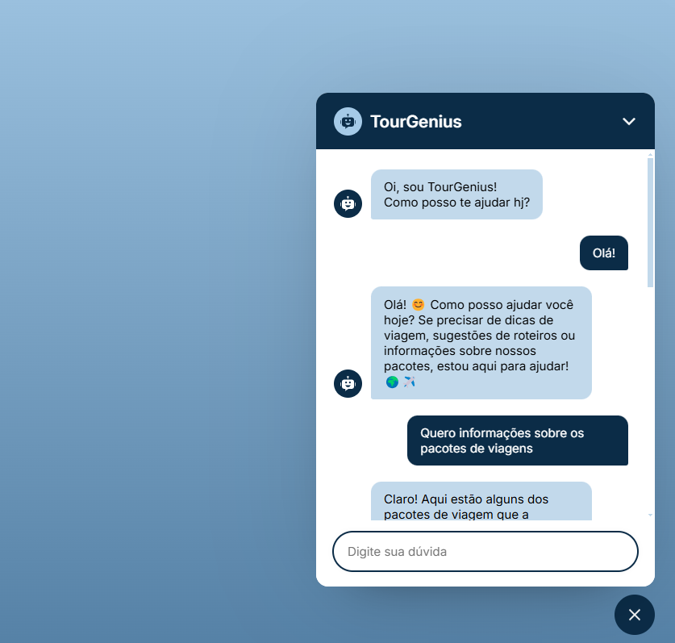

# TourGenius 🤖

Um chatbot inteligente para o setor de turismo, oferece informações sobre sua empresa e pontos turísticos, facilitando o planejamento de viagens e o atendimento aos clientes. Este projeto utiliza a API de inteligência artificial da empresa Stec AI para fornecer respostas relevantes e personalizadas aos usuários.

<div>
  
</div>

## Índice

- [Funcionalidades](#funcionalidades)
- [Tecnologias Utilizadas](#tecnologias-utilizadas)
- [Como o Chatbot foi Treinado](#como-o-chatbot-foi-treinado)
- [Comunicação com a API](#comunicação-com-a-api)
- [Como Usar](#como-usar)
- [Exemplos](#exemplos)

## Funcionalidades

- **Atendimento ao cliente:** Esclarece dúvidas sobre a empresa, como horários de funcionamento, serviços oferecidos, preços e formas de pagamento.
- **Informações turísticas:** Fornece detalhes sobre pontos turísticos, como história, horários de visitação, preços de ingressos e atrações próximas.
- **Sugestão de roteiros:** Ajuda os usuários a planejar suas viagens, oferecendo sugestões de roteiros personalizados de acordo com seus interesses e tempo disponível.
- **Disponibilidade 24 horas:** Permite que os usuários obtenham informações e tirem dúvidas a qualquer hora do dia ou da noite.

## 💻 Tecnologias Utilizadas

- **Front-end:**

  - 
  - 
  - 
  - 
  - 

- **Back-end:**

  - 

- **Integração com IA:** Stec AI Framework

## 🦾 **Como o Chatbot foi Treinado**

O chatbot foi desenvolvido com foco em turismo e integrado a uma API para fornecer informações dinâmicas e relevantes aos usuários. O processo de treinamento do chatbot incluiu os seguintes aspectos:

### Dados utilizados para o treinamento:

- A base de dados utilizada inclui informações sobre pontos turísticos, roteiros, eventos, hotéis e dicas de viagem. Essas informações foram extraídas de diversas fontes confiáveis relacionadas ao turismo e foram integradas à **API de IA**.
- Também foram utilizadas interações de usuários simuladas para ajudar o modelo a compreender perguntas comuns e contextos frequentes no setor de turismo.

### Técnica de treinamento:

- O chatbot foi treinado usando técnicas de **aprendizado supervisionado**, onde dados de entrada e saídas esperadas foram fornecidos para ajustar os parâmetros do modelo.
- A **API de IA** é responsável por realizar o processamento das consultas dos usuários e fornecer respostas contextualizadas, com a possibilidade de aprender com interações contínuas.

### Ferramentas utilizadas:

- O chatbot foi desenvolvido utilizando o framework de IA **Stec AI**, que proporciona a base necessária para integrar dados, processar solicitações e fornecer respostas em tempo real.

## 📞 **Comunicação com a API**

O front-end do chatbot de turismo foi desenvolvido utilizando **React** e **Vite**, enquanto o back-end é implementado com **Node.js**. O processo de comunicação entre o front-end e a API segue os seguintes parâmetros:

- **Tecnologia utilizada para fazer as requisições:**
  - Para fazer as requisições à API, foi utilizada a **Fetch API** do JavaScript. Essa tecnologia permite realizar solicitações HTTP assíncronas, como `GET`, `POST`, etc., e retornar as respostas para o front-end de forma eficiente.
- **Formato de dados nas requisições e respostas:**
  - As requisições e respostas entre o front-end e a API são feitas no formato **JSON**. Esse formato é amplamente utilizado devido à sua leveza e facilidade de manipulação tanto no lado do cliente quanto no servidor.
- **Endpoints da API utilizados:**
  - O chatbot se comunica com a API da **Stec AI** por meio de um endpoint principal para enviar e receber dados relacionados a consultas turísticas. A API recebe o **prompt** do usuário (mensagem) e retorna a resposta relacionada a pontos turísticos, pacotes de viagem, informações sobre eventos, e mais.
  - **Endpoint Principal:**
    - `POST /single`: Este endpoint é usado para enviar as consultas do usuário e obter as respostas da IA. O corpo da requisição inclui os dados necessários, como o prompt (pergunta do usuário), ID do cliente, ID do projeto e outros parâmetros relevantes para a busca e processamento da resposta.

Com isso, o front-end em **React** utiliza **Fetch API** para enviar os dados ao back-end, que por sua vez, processa as informações com a **API de IA** e retorna as respostas necessárias para o chatbot. Esse fluxo assegura uma comunicação rápida e eficiente, proporcionando uma experiência de usuário fluída e dinâmica.

## ❔Como Usar

### Pré-requisitos

Antes de executar o projeto localmente, verifique se você possui as seguintes dependências instaladas:

- **Node.js** (você pode baixar [aqui](https://nodejs.org/))
- **Vite** (para iniciar o projeto com um ambiente de desenvolvimento rápido)
- **React** (para a interface do usuário)

### Passos para executar o projeto

1. **Clone o repositório:**

   Para começar, faça o clone deste repositório para sua máquina local:

   ```bash
   git clone https://github.com/rajssq/Chatbot-TourGenius.git

   ```

2. **Instale as dependências:**

   Acesse a pasta do projeto e instale as dependências necessárias utilizando o comando:

   ```bash
   cd Chatbot-TourGenius
   npm install

   ```

3. **Configuração da API:**

   O chatbot utiliza a API Stec AI para fornecer as respostas dinâmicas. Certifique-se de configurar corretamente a API da seguinte forma:

   - Crie um arquivo .env na raiz do projeto.

   - Adicione suas credenciais da API no arquivo .env:
     ```bash
      API_URL="URL da api"
      CLIENT_ID="Seu client id"
      PROJECT_ID="Seu project id"
      SERVICE="nome do serviço"
     ```

4. **Inicie o servidor de desenvolvimento:**

   Para rodar o projeto localmente, execute o seguinte comando:

   ```bash
   npm run dev
   ```

Isso iniciará o servidor de desenvolvimento. Abra o navegador e acesse http://localhost:3000 para ver o chatbot em funcionamento.

## 💡Exemplos de como usar o Chatbot

- **Usuário:** "Qual o horário de funcionamento do Teatro Amazonas?"
- **TourGenius:** "O Teatro Amazonas geralmente abre de terça a sábado, das 9h às 17h, e aos domingos, das 9h às 14h."

- **Usuário:** "Gostaria de um roteiro de 3 dias para São Paulo"
- **TourGenius:** "Claro! Aqui está um roteiro de 3 dias em São Paulo para você aproveitar ao máximo a cidade:.."
